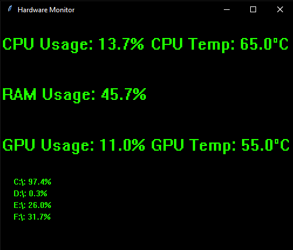

# Hardware-Monitor v1.5

A hardware monitoring tool built for windows with real-time system statistics and resource tracking. 

## Features
-Real time monitoring of:  
  -CPU usage/temperature  
  -GPU usage/temperature  
  -RAM usage  
  -Disk storage  
-Low resource consumption  
-Simple easy to understand GUI  

## Installation

Download the most recent release (1.5) and run the .exe file. This will use an installer to easily download everything necessary.

**Alternatively, to build it yourself:**

### Requirements
-Python 3.8+  
-pip package manager  

# Clone repository
git clone https://github.com/Natecaud/Hardware-Monitor.git  
cd Hardware-Monitor

# Install dependencies
pip install -r requirements.txt

## Contributing
Contributions are welcome! To contribute, follow these guidelines:
1. Fork the repository
2. Create a feature branch(git checkout -b feature/your_feature)
3. Commit changes (git commit -m 'Add new feature')
4. Push to branch (git push origin feature/your_feature)
5. Open a pull request

## Acknowledgements
-Core functionality powered by [psutil](https://github.com/giampaolo/psutil)  
-GPU monitoring using [GPUtil](https://github.com/anderskm/gputil)  
-Windows support via [pywin32](https://github.com/mhammond/pywin32)  
-CPU temperature monitoring using [OpenHardwareMonitor](https://openhardwaremonitor.org)
